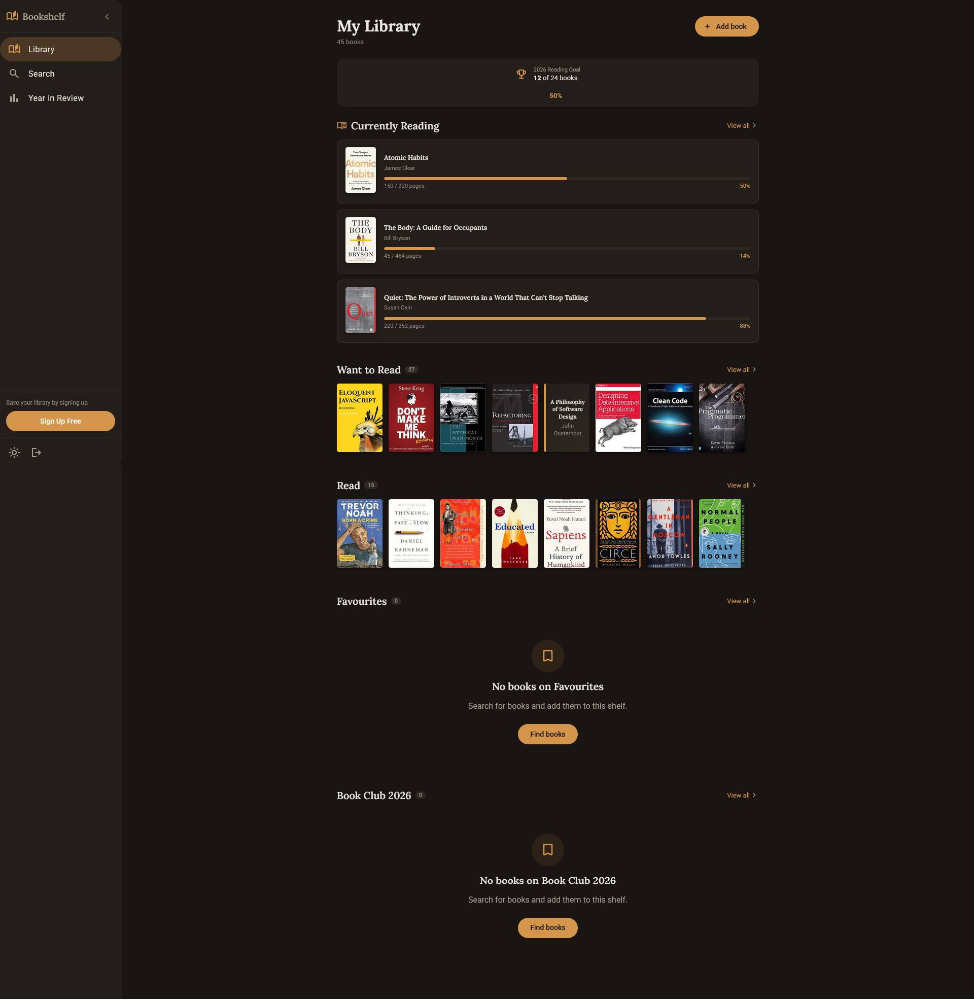

# Bookshelf — Curtis (webguy83)

A personal reading tracker where you search for books, organize them into shelves, track reading progress, set annual goals, and explore year-in-review statistics.

**Live URL:** [https://personal-reading-list-b96cd.web.app](https://personal-reading-list-b96cd.web.app)



---

## Overview

Bookshelf is a full-stack Angular 21 reading tracker backed by Firebase. Users can search the Open Library catalog, organize books into custom shelves, log reading progress by page, set yearly goals, and review reading statistics for the year. A fully functional guest mode lets anyone explore the app immediately with pre-populated sample data.

### Tech Stack

| Layer | Technology |
|-------|-----------|
| Framework | Angular 21 (zoneless, standalone, signals) |
| Database | Firebase Firestore |
| Authentication | Firebase Auth |
| Book API | Open Library API |
| Hosting | Firebase Hosting |
| Styling | CSS custom properties + Angular Material 21 (M3) + Tailwind CSS v4 |
| Charts/Viz | CSS-only bar charts (no third-party chart library) |
| Testing | Vitest (unit) + Playwright (E2E) |

---

## Design Decisions

These are the product and design choices I made where the spec left room for interpretation.

### Year-in-Review & Reading Insights

**The problem I was solving:** Presenting reading data in a way that feels meaningful and rewarding at any scale — whether a user has read 2 books or 50.

**My approach:** A focused dashboard with summary stat cards (books read, pages read, average rating, top genre), a CSS bar chart for monthly reading pace, genre breakdown progress bars, a pace indicator (ahead / on-track / behind), and a highlights section surfacing the longest and shortest books of the year.

**Why I chose this approach:** A clean data-dashboard felt more reliable and reusable than a narrative scroll — it works equally well for partial-year data and scales gracefully with sparse input. CSS-only charts kept the bundle lean without a charting library dependency.

**What I'd do differently:** Add a shareable card export (Canvas API) and a previous-year comparison view.

---

### Book Discovery & Recommendations

**The problem I was solving:** New users land with an empty library and no context — the cold-start experience needed to feel useful, not empty.

**My approach:** Guest mode is pre-populated with a curated set of real books spread across all three default shelves with realistic progress and ratings, so visitors immediately see a full, functional library without signing up. Search is powered by Open Library and returns results as cover cards with inline "Add to shelf" actions.

**Why I chose this approach:** Pre-populated guest data is the fastest path to demonstrating value. It removes the onboarding barrier entirely — you can explore every feature before creating an account.

**What I'd do differently:** Add a curated "popular books" browse panel and genre-based suggestions derived from the user's existing rated books.

---

### Reading Progress Tracking UX

**The problem I was solving:** Progress updates need to be low-friction enough that users actually do them, while producing data useful for statistics and goal tracking.

**My approach:** Page number input on the book detail page with an inline edit-in-place pattern (pencil icon → number input → Save/Cancel). Progress is stored as both a raw page number and a percentage, displayed as a progress bar with "current / total pages" label. Currently-reading books surface their progress bar directly on the library dashboard for at-a-glance tracking.

**Why I chose this approach:** Page numbers are the most universal unit — they work for any reader regardless of device or format. Keeping the input on the book detail page keeps the main library view uncluttered.

**What I'd do differently:** Add a quick-update action from the library view (e.g., a tap on the progress bar) to reduce navigation friction.

### Other Design Choices

The warm amber/copper brand palette from `tokens.css` is applied consistently via CSS custom properties, with full dark mode support. Navigation uses a collapsible desktop sidenav and a fixed mobile bottom nav — both built with Angular Material and branded with `color-mix()` for active state highlighting without state-layer flicker. A custom `AccentButtonDirective` applies the brand accent color to all primary buttons without overriding Angular Material's theming architecture.

---

## Development Journey

### Initial Approach vs. Final

Started with a clean Angular 21 scaffold using the spec's brand kit tokens, building features iteratively: auth → library store → search → shelf management → book detail → year-in-review. The architecture stayed consistent throughout — zoneless change detection with `OnPush` components and a signal-based `LibraryStore` as the single source of truth.

### Decisions Reconsidered

Initially used a `MatProgressSpinner` on the login button during authentication, which caused a layout shift when the spinner replaced the label. Replaced it with a simple text swap ("Sign in" → "Signing in…") which is cleaner, more accessible, and avoids the dependency on `@angular/animations`.

### What Surprised Me

How much of the bundle size is unavoidable baseline — Firebase Auth + Firestore SDK + Angular Material shell components account for almost the entire 1 MB initial bundle. The lazy-loaded route chunks are small, but the framework and SDK cost is front-loaded. The transfer size (~257 kB gzip) is what users actually download, which is entirely reasonable for the feature set.

### Session Breakdown

| Session | Focus | What I Accomplished |
|---------|-------|-------------------|
| 1 | Core features | Auth, Firestore data model, LibraryStore, book search, shelf CRUD, book detail |
| 2 | UI polish & testing | Year-in-review page, guest mode, reading progress, responsive nav, 292 unit tests |
| 3 | Quality & deployment | Lighthouse audit (Accessibility 100 / SEO 100), accessibility fixes, Firebase Hosting deploy |

---

## AI Collaboration Reflection

### How I Used AI

AI drove the majority of the implementation — component architecture, Firestore data modeling, reactive signal patterns, CSS styling, test suites, and accessibility fixes. I directed feature scope, reviewed output, and made product decisions at each step.

### What Worked Well

Providing the full spec context upfront (`AGENTS.md`, brand kit, requirements) meant AI could make consistent product decisions without repeated clarification. Iterating on Lighthouse audit results was particularly effective — giving AI the exact scores and errors produced targeted, accurate fixes.

### What I Learned

AI is most valuable on well-defined problems with clear acceptance criteria. For open-ended design decisions (like how to visualize monthly reading pace), it's better to make the call yourself first and ask AI to implement it than to ask AI to design it from scratch.

### Where I Pushed Back

The initial login loading state used a `MatProgressSpinner`, which required `@angular/animations`. Since that package wasn't installed, AI's first suggestion would have introduced a broken dependency. Redirecting to a text-swap solution was cleaner for both UX and bundle size.

---

## Differentiators

### Chosen Differentiator

**Guest Experience as a First-Class Feature**

Rather than a generic "try as guest" placeholder, the guest mode is a fully realized, pre-populated library built from the project's sample book dataset. Books are distributed across all three default shelves with realistic ratings, notes, reading progress, and a pre-set annual goal — giving visitors a complete picture of the app within seconds of landing.

**Why I chose this:** The cold-start problem is the single biggest barrier to demonstrating a reading tracker's value. Solving it properly meant investing in realistic, well-curated seed data rather than a bare skeleton.

**How it enhances the product:** Every feature — library overview, progress bars, year-in-review stats, genre breakdowns — works fully in guest mode. Reviewers and visitors can evaluate the complete product without creating an account.

**What I learned:** The quality of sample data matters as much as the UI. Generic placeholder books undermine the warm, personal feeling the brand kit is designed to create.

---

## Self-Assessment

| Category | Rating | Notes |
|----------|--------|-------|
| **Works for real users** | 5/5 | Deployed to Firebase Hosting, full auth and Firestore backend |
| **Book API integration** | 4/5 | Open Library with missing cover placeholders, graceful metadata fallbacks |
| **Design-it-yourself features** | 4/5 | Solid year-in-review dashboard, intuitive progress tracking, strong guest onboarding |
| **Design quality** | 5/5 | Brand kit applied consistently, warm palette, Lora + Inter pairing, polished dark mode |
| **Responsive design** | 5/5 | Collapsible sidenav on desktop, fixed bottom nav on mobile, fluid at all breakpoints |
| **Performance** | 4/5 | 257 kB gzip transfer, all routes lazy-loaded; Firebase SDK drives the raw bundle size |
| **Accessibility** | 5/5 | Lighthouse Accessibility 100, semantic landmarks, ARIA progressbars, WCAG contrast |
| **Edge case handling** | 4/5 | Empty states on every view, missing cover placeholders, duplicate book prevention |
| **Code quality** | 5/5 | Zoneless Angular 21, OnPush throughout, signal-based store, 292 passing unit tests |
| **Landing page** | 5/5 | Feature grid, real book cover showcase, clear CTA, guest access without friction |
| **Guest experience** | 5/5 | Pre-populated with real books, progress, ratings, and a live reading goal |

### Lighthouse Scores

| Category | Score |
|----------|-------|
| Performance | — |
| Accessibility | 100 |
| Best Practices | 77 (Firebase third-party cookies — not fixable) |
| SEO | 100 |

### Strengths

The signal-based `LibraryStore` kept state management clean and testable across both authenticated and guest sessions without duplicating logic. The brand kit was applied with enough consistency that light and dark modes both feel intentional rather than bolted on. The guest mode is genuinely impressive — visitors see a full, living library the moment they land.

### Areas for Improvement

The year-in-review would benefit from shareable image export and year-over-year comparison. Book discovery is purely search-driven — a curated browse panel or personalized recommendations would make the onboarding experience richer for new users building a library from scratch.

---

## Known Limitations

- No offline support — requires network for Firestore reads/writes
- Reading progress tracking does not support audiobook timestamps or e-reader percentage
- No social features or public profile sharing
- Year-in-review is current year only — no historical year selection

---

## Running Locally

```bash
# Clone the repo
git clone https://github.com/webguy83/personal-reading-list.git
cd personal-reading-list

# Install dependencies
npm install

# Run the development server
ng serve
```

Open [http://localhost:4200](http://localhost:4200) in your browser. Use "Continue as Guest" to explore without an account.

### Environment Variables

Firebase config is in `src/environments/environment.ts`. To connect to your own Firebase project, replace the config object with your project's credentials from the Firebase Console.

| Variable | Description |
|----------|------------|
| `firebase.apiKey` | Firebase project API key |
| `firebase.authDomain` | Firebase Auth domain |
| `firebase.projectId` | Firestore project ID |
| `firebase.storageBucket` | Firebase Storage bucket |
| `firebase.messagingSenderId` | FCM sender ID |
| `firebase.appId` | Firebase app ID |

---

## Acknowledgments

Built as a [Frontend Mentor Product Challenge](https://www.frontendmentor.io).
